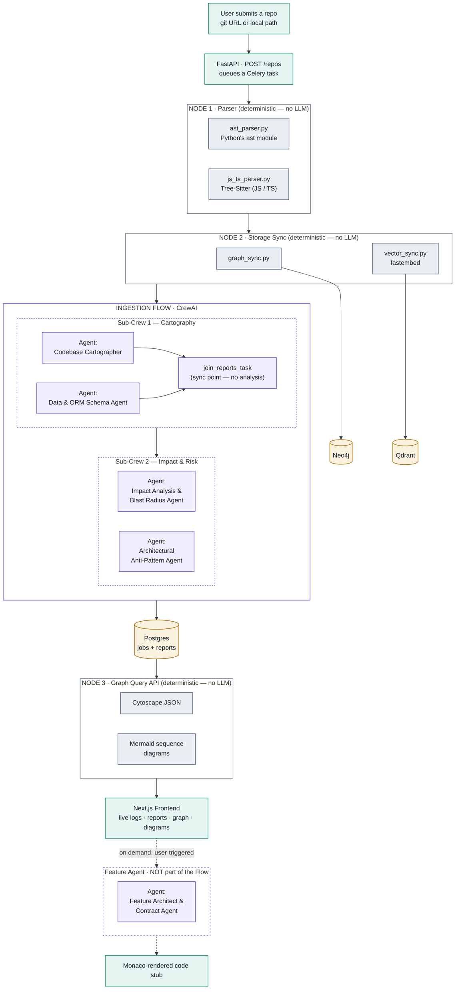

# 🕸️ CodeGrapher

**Turn any codebase into an interactive, queryable knowledge graph — then let a crew of AI agents reason over it.**

CodeGrapher clones a repository, parses it deterministically into structural facts (files, classes, functions, ORM models, HTTP routes, call graphs), pushes those facts into a real graph database and a vector database, and hands them to a multi-agent CrewAI pipeline that maps the architecture, traces blast radius for proposed changes, flags anti-patterns, and drafts new feature stubs that match the codebase's own conventions.

No part of the *extraction* is AI-guessed. Only the *reasoning* is.

---

## Table of Contents

- [What it actually does](#what-it-actually-does)
- [Architecture](#architecture)
- [How the pipeline works](#how-the-pipeline-works)
- [Tech stack](#tech-stack)
- [Project structure](#project-structure)
- [Getting started](#getting-started)
- [API reference](#api-reference)
- [Known limitations](#known-limitations-read-this)
- [Design notes worth knowing](#design-notes-worth-knowing)

---

## What it actually does

1. **You give it a repo** — a git URL or a local path.
2. **Node 1** parses it with zero AI: Python's own `ast` module for `.py` files, Tree-Sitter for `.js/.jsx/.ts/.tsx`. Every extracted fact traces back to a specific line of source.
3. **Node 2** pushes those facts into **Neo4j** (files/classes/functions/relationships as real graph nodes and edges) and **Qdrant** (meaning-searchable embeddings of each symbol).
4. **A CrewAI multi-agent Flow** runs two sub-crews in sequence — one maps the architecture and schema, the next traces impact/risk and anti-patterns — then a third, on-demand agent drafts feature stubs matching the codebase's existing conventions.
5. **The frontend** shows it all: live agent progress over SSE, the four analysis reports, an interactive Cytoscape graph, Mermaid call-sequence diagrams, and Monaco-rendered code stubs.

---

## Architecture



**Reading the diagram:** solid arrows are the automatic sequence — every submitted repo runs Node 1 → Node 2 → Sub-Crew 1 → Sub-Crew 2 without stopping. The dashed path around the Feature Agent is separate: a user has to explicitly ask for a feature, at any point after ingestion, or never. Redis isn't drawn as a pipeline stage because it isn't one — it's the Celery broker and the backing store for live progress events, sitting underneath the whole flow rather than inside it.

---

## How the pipeline works

### Node 1 — Parser (`src/codegrapher/parser/`)

Two kinds of facts come out of this node, and they carry different confidence levels:

| Fact type | Reliability | Example |
|---|---|---|
| Grammar facts | 100% certain — there's only one way a given piece of syntax parses | function/class names, imports, call sites |
| Framework heuristics | Pattern-matched against known conventions, not guaranteed | "is this class an ORM model?", "does this function mutate the database?", "is this an HTTP route?" |

- **Python** (`ast_parser.py`) — uses the standard library `ast` module. ORM detection is driven by a **framework profile registry** (`frameworks.py`) covering **SQLAlchemy** and **Django** conventions, so adding a third ORM is "register a new profile," not "rewrite the parser." Mutation tracking follows variable reassignment and one level of same-file helper-function calls, and explicitly surfaces `unresolved_mutation_calls` instead of silently dropping ambiguous cases.
- **JavaScript / TypeScript** (`js_ts_parser.py`) — uses **Tree-Sitter**. Extracts functions (declarations, arrow functions, class methods), classes, imports (both ESM `import` and CommonJS `require`), calls, and Express-style routes (`router.post(path, handler)`). ORM/mutation detection is intentionally **not** implemented for JS/TS — see [Known Limitations](#known-limitations-read-this).

Both parsers emit the same shape, merged by `parse_repo()` under one `repo_name`, so everything downstream is language-agnostic.

### Node 2 — Storage Sync (`src/codegrapher/storage/`)

Pure mechanical translation, no LLM involved:

- **`graph_sync.py`** — one Cypher `MERGE` per fact. `File`/`Class`/`Function`/`Field` become nodes; `DEFINES`/`CALLS`/`MUTATES`/`RELATES_TO`/`IMPORTS`/`CALLS_EXTERNAL`/`USES_EXTERNAL_SERVICE` become edges. Every node is namespaced by `repo_name` so multiple repos can share one Neo4j instance without collisions.
- **`vector_sync.py`** — since there's no raw source text to embed (only structural metadata), each function/class gets a short synthesized description ("Function `charge_card` in `billing.py`. Calls: `stripe.Client`. Uses external service: stripe.") which is what actually gets embedded via **fastembed** (ONNX-based, no PyTorch/CUDA dependency) and stored in **Qdrant**.

### The CrewAI Ingestion Flow (`src/codegrapher/flows/ingestion_flow.py`)

A real CrewAI `Flow` (`@start`/`@listen`), not hand-rolled orchestration:

- **`run_cartography`** kicks off **Sub-Crew 1**, whose two agents (Cartographer, ORM Schema Agent) run **in parallel** — they're independent, so there's no reason to serialize them. A third task, `join_reports_task`, exists purely to satisfy CrewAI's rule that a crew can end with at most one trailing async task; it does no analysis of its own, only reproduces both reports verbatim.
- **`@listen(run_cartography)`** triggers **Sub-Crew 2** automatically once Sub-Crew 1 finishes — genuinely sequential, since Impact Analysis needs the architecture/schema reports as input.

### Feature Agent (`src/codegrapher/crews/feature_agent/`)

Deliberately **not** part of the Flow. One agent has nothing to coordinate with, so it's a plain `Agent` + `Task` call, not a `Crew` — and it's triggered on demand (`request_feature()`), whenever a user actually asks for something, independent of when ingestion happened.

### Node 3 — Graph Query API (`src/codegrapher/api/graph_query.py`, `sequence_diagram.py`)

Folded into the API layer rather than built as a standalone script, since its whole job is formatting graph data for a UI to render:

- `GET /repos/{id}/graph` → Cytoscape.js-shaped JSON, queried live from Neo4j.
- `GET /repos/{id}/sequence/{function}` → a Mermaid sequence diagram of that function's call chain (up to 4 hops, following both in-repo `CALLS` and `CALLS_EXTERNAL` edges).

### API + Frontend (`src/codegrapher/api/`, `frontend/`)

- **FastAPI** wraps the whole pipeline behind HTTP: submit a repo, poll status, stream live progress over **SSE** (backed by a Redis list, so a client connecting mid-run still sees full history), pull the graph, pull a sequence diagram, request a feature.
- **Celery + Redis** run ingestion asynchronously — parsing + syncing + two sub-crews can take a while, so it doesn't block the request.
- **Postgres** persists every job's status and reports, so the API is stateless across requests — nothing relies on in-memory state from the Celery worker process.
- **Next.js** frontend: submit a repo (URL or path), watch live logs stream in, view all four reports, explore the synced graph, render a sequence diagram for any function, and request a feature with the result shown in a **Monaco** editor.

---

## Tech stack

<table>
<tr><th>Layer</th><th>Technology</th><th>Why</th></tr>

<tr><td rowspan="4"><strong>Agents & LLM</strong></td>
<td><a href="https://github.com/crewAIInc/crewAI">CrewAI</a> (Flows, Crews, Agents)</td><td>Multi-agent orchestration — Sub-Crew 1, Sub-Crew 2, Feature Agent, and the ingestion Flow that chains them</td></tr>
<tr><td>Groq (Llama 3.3 70B) via LiteLLM</td><td>Fast inference for every agent — CrewAI 1.x talks to it through its native LiteLLM path, no LangChain</td></tr>
<tr><td>Custom <code>GroqLLM</code> wrapper (<code>llms.py</code>)</td><td>Strips a CrewAI/LiteLLM prompt-cache flag Groq rejects; retries short rate limits, fails fast on long ones instead of hanging a worker</td></tr>
<tr><td>Framework profile registry (<code>frameworks.py</code>)</td><td>Pluggable ORM-convention detection (SQLAlchemy, Django) instead of one hardcoded set</td></tr>

<tr><td rowspan="2"><strong>Parsing (Node 1)</strong></td>
<td>Python <code>ast</code> (stdlib)</td><td>Deterministic Python parsing — no dependency, no LLM</td></tr>
<tr><td><a href="https://tree-sitter.github.io/tree-sitter/">Tree-Sitter</a> (JS/TS grammars)</td><td>Deterministic JS/TS parsing via the same grammar-first philosophy</td></tr>

<tr><td rowspan="2"><strong>Storage (Node 2)</strong></td>
<td><a href="https://neo4j.com/">Neo4j</a></td><td>Graph database — structural facts as real nodes/edges, fast N-hop traversal</td></tr>
<tr><td><a href="https://qdrant.tech/">Qdrant</a> + <a href="https://github.com/qdrant/fastembed">fastembed</a></td><td>Vector search over synthesized symbol descriptions; fastembed is ONNX-based (no PyTorch/CUDA)</td></tr>

<tr><td rowspan="5"><strong>Backend / API</strong></td>
<td><a href="https://fastapi.tiangolo.com/">FastAPI</a></td><td>REST + SSE endpoints wrapping the whole pipeline</td></tr>
<tr><td><a href="https://docs.celeryq.dev/">Celery</a> + Redis</td><td>Async ingestion jobs, run with <code>--pool=solo</code> (prefork breaks the async Postgres engine — see Design Notes)</td></tr>
<tr><td>SQLAlchemy 2.0 (async) + asyncpg</td><td>Job/report persistence</td></tr>
<tr><td>PostgreSQL</td><td>Job history and report storage</td></tr>
<tr><td>Redis</td><td>Celery broker + live SSE progress event log</td></tr>

<tr><td rowspan="6"><strong>Frontend</strong></td>
<td><a href="https://nextjs.org/">Next.js 16</a> (App Router)</td><td>React framework, client-rendered dashboard</td></tr>
<tr><td>TypeScript + Tailwind CSS 4</td><td>Type safety, styling</td></tr>
<tr><td><a href="https://js.cytoscape.org/">Cytoscape.js</a> (<code>react-cytoscapejs</code>)</td><td>Interactive graph rendering</td></tr>
<tr><td><a href="https://www.mermaidchart.com/">Mermaid</a></td><td>Call-sequence diagram rendering, client-side</td></tr>
<tr><td><a href="https://microsoft.github.io/monaco-editor/">Monaco Editor</a></td><td>Syntax-highlighted, read-only rendering of generated feature stubs</td></tr>
<tr><td>Server-Sent Events (native <code>EventSource</code>)</td><td>Live ingestion log streaming, no extra client library</td></tr>

<tr><td rowspan="3"><strong>DevOps</strong></td>
<td>Docker + Docker Compose</td><td>Infra services (Neo4j/Qdrant/Postgres/Redis) always containerized; API/worker/frontend images written and ready (<a href="#known-limitations-read-this">see limitations</a>)</td></tr>
<tr><td><a href="https://docs.astral.sh/uv/">uv</a></td><td>Python dependency management, fast installs, lockfile</td></tr>
<tr><td>npm</td><td>Frontend dependency management</td></tr>

</table>

---

## Project structure

```
repo-graph-builder/
├── docker-compose.yml          # neo4j, qdrant, postgres, redis, api, worker, frontend
├── Dockerfile.api               # shared image for the FastAPI server + Celery worker
├── pyproject.toml / uv.lock
│
├── src/codegrapher/
│   ├── parser/
│   │   ├── ast_parser.py        # Node 1 — Python (stdlib ast)
│   │   ├── js_ts_parser.py      # Node 1 — JS/TS (Tree-Sitter)
│   │   └── frameworks.py        # ORM profile registry (SQLAlchemy, Django)
│   │
│   ├── storage/
│   │   ├── graph_sync.py        # Node 2 — Neo4j
│   │   └── vector_sync.py       # Node 2 — Qdrant (fastembed)
│   │
│   ├── crews/
│   │   ├── cartography_crew/    # Sub-Crew 1: Cartographer + ORM Schema Agent
│   │   ├── impact_crew/         # Sub-Crew 2: Impact Analysis + Anti-Pattern Agent
│   │   └── feature_agent/       # On-demand Feature Architect (no Crew wrapper)
│   │
│   ├── flows/
│   │   └── ingestion_flow.py    # CrewAI Flow chaining Sub-Crew 1 -> Sub-Crew 2
│   │
│   ├── llms.py                  # GroqLLM wrapper (cache-flag fix, rate-limit retry)
│   │
│   ├── api/
│   │   ├── server.py            # FastAPI app — all HTTP/SSE endpoints
│   │   ├── tasks.py             # Celery ingestion task
│   │   ├── models.py            # IngestionJob (Postgres)
│   │   ├── graph_query.py       # Node 3 — Cytoscape JSON
│   │   ├── sequence_diagram.py  # Node 3 — Mermaid diagrams
│   │   ├── repo_source.py       # git-clone-or-local-path resolution
│   │   └── progress.py          # Redis-backed live event log
│   │
│   └── sample_data/             # toy_repo (FastAPI+SQLAlchemy), toy_django_repo,
│                                 # toy_express_repo — fixtures proving each parser path
│
└── frontend/
    ├── Dockerfile
    └── src/app/page.tsx          # the whole UI: submit form, live logs, reports,
                                   # Cytoscape graph, Mermaid diagrams, Monaco stub viewer
```

---

## Getting started

### Prerequisites

- Python 3.11+, [uv](https://docs.astral.sh/uv/)
- Node.js 22+, npm
- Docker + Docker Compose
- A [Groq API key](https://console.groq.com/)

### 1. Environment

```bash
cp .env.example .env
# fill in GROQ_API_KEY — the rest of the defaults match docker-compose.yml
```

### 2. Infrastructure

```bash
docker compose up -d neo4j qdrant postgres redis
```

### 3. Backend

```bash
uv sync
uv run uvicorn codegrapher.api.server:app --port 8000          # terminal 1
uv run celery -A codegrapher.api.celery_app worker --loglevel=info --pool=solo   # terminal 2
```

> `--pool=solo` is required — see [Design Notes](#design-notes-worth-knowing).

### 4. Frontend

```bash
cd frontend
npm install
npm run dev
```

Open `http://localhost:3000`, submit a repo (try `src/codegrapher/sample_data/toy_repo` as an absolute path, or any public git URL), and watch it go.

### Or: everything in containers

```bash
docker compose up -d --build
```

(Application images are written and compose-wired but untested in this environment — see [Known Limitations](#known-limitations-read-this).)

---

## API reference

| Method | Path | Description |
|---|---|---|
| `POST` | `/repos` | Submit a repo (`repo_path`: git URL or local path, optional `proposed_edit`) — returns a `job_id`, kicks off async ingestion |
| `GET` | `/repos/{job_id}` | Poll job status (`pending`/`running`/`done`/`failed`) and the four reports once done |
| `GET` | `/repos/{job_id}/events` | SSE stream of live ingestion progress |
| `GET` | `/repos/{job_id}/graph` | Cytoscape.js-shaped JSON of the synced graph |
| `GET` | `/repos/{job_id}/sequence/{function_name}` | Mermaid sequence diagram for one function's call chain |
| `POST` | `/repos/{job_id}/feature` | On-demand feature stub generation (`feature_request`: plain-language description) |

---

## Known limitations (read this)

Being upfront about scope boundaries is part of the design, not an afterthought:

- **Heuristics can be wrong, on purpose transparently.** "Is this an ORM model?", "does this mutate the database?" are pattern-matches against common conventions, not certainties. Unresolved mutation calls are surfaced explicitly (`unresolved_mutation_calls`) instead of silently dropped.
- **JS/TS parsing has no ORM/mutation detection.** Sequelize, Mongoose, Prisma, and TypeORM each have different-enough conventions that replicating the Python side's heuristics per-framework is a separate, larger piece of work — not built here.
- **Same-file mutation tracing only goes one level deep**, and matches helper functions by name only (not fully-qualified) — a real limitation on codebases with naming collisions or deeper call chains.
- **Docker application images are untested.** `Dockerfile.api` and `frontend/Dockerfile` are written and `docker compose config` validates cleanly, but the actual build was never completed in the development environment (a restrictive network blocked container-level internet access). Infra containers (Neo4j/Qdrant/Postgres/Redis) run and were used throughout.
- **Express route detection only covers named handlers** (`router.post("/x", handlerName)`) — an inline handler (`router.post("/x", (req, res) => {...})`) has no name to attach the route fact to.

---

## Design notes worth knowing

- **Why Celery runs with `--pool=solo`:** the default prefork pool forks worker processes *after* SQLAlchemy's async engine is created, and forked children end up sharing a corrupted asyncpg connection. Fixed with `NullPool` (no connection reuse across event loops) *and* `--pool=solo` (no forking at all) — both were needed; each alone still failed under real testing.
- **Why `join_reports_task` exists:** Cartographer and the ORM Schema Agent are independent, so they run in parallel (`async_execution: true`). CrewAI requires a crew to end with at most one trailing async task, so a third task exists purely as the synchronization point — it does no analysis, it only reproduces both reports verbatim.
- **Why the Feature Agent isn't a `Crew`:** a `Crew` coordinates *multiple* agents through a process. With one agent, there's nothing to coordinate — wrapping it would be indirection with no behavior behind it.
- **Why repo_name derivation is centralized (`repo_source.py`):** Neo4j/Qdrant namespace everything by `repo_name`, derived from the directory's basename. A cloned git repo lands in a randomly-named temp directory unless the clone step explicitly names it after the repo — so `derive_repo_name()` is the single source of truth both the sync step and the later graph-lookup step call, keeping them from drifting apart.

---

<p align="center"><sub>Built phase by phase — agentic core first, then Node 1, then Node 2, then the full-stack wrap — with an actual human reviewing each stage.</sub></p>
